# 设计文档：design-patterns-showcase（设计模式实战示例工程）

## Overview

本设计文档定义一个基于 Spring Boot 的设计模式实战教学示例工程的技术方案。工程目标是以企业级真实业务场景（订单、支付、风控、通知、审批流、缓存、限流、对账、报表等）系统化演示 GoF 23 种经典设计模式中的 **P0 核心模式 + P1 扩展模式**（共 21 个），并严格贯彻 SOLID 原则与团队统一代码规范，使示例可直接作为企业项目的参考实现。

### 项目定位

- 面向具备 Java 与 Spring 基础、希望深入掌握设计模式实战落地的开发者。
- 每个模式均基于真实业务场景，具备足够复杂度（每模式至少 3 个相互协作的类/接口），拒绝 `Foo/Bar/Test` 式占位命名。
- 每个模式配套统一结构的说明文档（Pattern_Doc）与可独立触发的演示入口（HTTP 接口或单元测试），并提供单元测试验证核心行为。
- 工程不引入完整 RuoYi 脚手架，而是自建轻量基础设施类，复刻 RuoYi 风格的统一返回与基类写法；不引入 Spring Security，删除接口的「权限校验」用自定义注解 + AOP 切面 mock 实现。

### 技术栈选型与版本

| 类别 | 选型 | 确定版本 | 选型理由 |
| --- | --- | --- | --- |
| 构建工具 | Maven | 3.6+（构建期） | 单一 `pom.xml` 统一声明全部依赖与确定版本号（满足 需求 1.6）。 |
| 运行平台 | JDK | 8 | 企业普遍性最高；RuoYi 主流版本基于 JDK 8；与所选 MyBatis Starter 的最低要求一致。 |
| 应用框架 | Spring Boot | 2.7.18 | 2.7.x 为社区免费支持的最后一个 2.x 主线版本，生态成熟、企业占有率高；与 RuoYi 风格（Spring Boot 2.x）一脉相承。 |
| 持久层框架 | MyBatis（mybatis-spring-boot-starter） | 2.3.2 | 官方兼容矩阵明确：Starter 2.3.x 对应 Spring Boot 2.7 + Java 8+。SQL 写在 XML，契合团队规范。 |
| 数据库 | H2（嵌入式，内存模式） | 由 Spring Boot 2.7.18 统一管理（2.1.x） | 启动即用、无需外部环境，适合教学演示；应用启动时自动建表并初始化数据。 |
| 简化工具 | Lombok | 由 Spring Boot 2.7.18 统一管理 | 仅用于实体/请求对象的 `@Data`，减少样板代码。 |
| 参数校验 | Hibernate Validator（spring-boot-starter-validation） | 由 Spring Boot 2.7.18 统一管理 | 提供 JSR-303 校验注解，配合 `@Validated` 在 Request 对象上声明式校验。 |
| 单元测试 | JUnit 5 + Mockito（spring-boot-starter-test 内置） | 由 Spring Boot 2.7.18 统一管理 | 标准测试栈，支持断言与 Mock。 |
| 属性测试 | jqwik | 1.8.x | Java 生态成熟的属性测试（PBT）库，原生集成 JUnit 5 Platform，用于验证设计文档中的正确性属性。 |

> 版本选型说明：之所以不选 Spring Boot 3.x + JDK 17，是因为本工程定位为「企业普遍性优先的标准档」，复刻 RuoYi 风格，2.7.x + JDK 8 的组合在国内企业存量项目中占比更高，迁移与参考价值更大。该选型满足 需求 1.1（基于 Spring Boot）与 需求 1.6（统一构建配置与确定版本）。

---

## Architecture

### 分层架构

工程遵循经典的分层架构，每个模式模块内部自成 Controller → Service → Domain（→ Mapper）的纵向切片，横向由 `common` 基础设施层统一支撑：

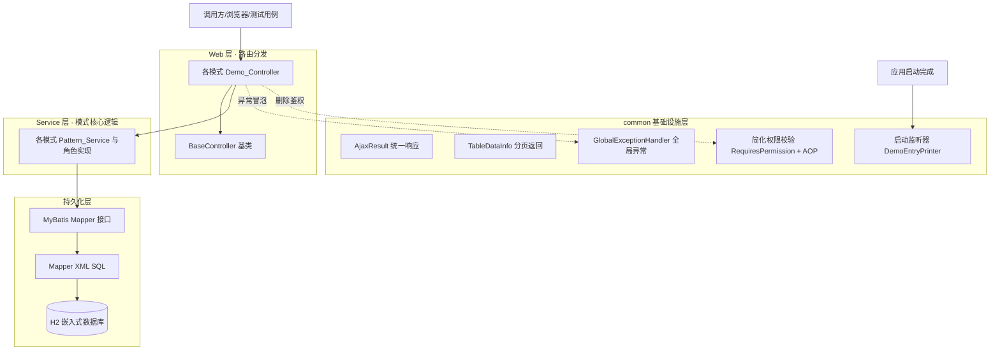

设计要点（满足 需求 9.4）：Controller 仅做路由分发，业务逻辑全部下沉至 Service；Controller 不写校验分支、不写循环、不写 try-catch、不直接操作 Mapper。异常统一向上冒泡至全局异常处理器。

### 包结构设计

顶层按 GoF 三大类别划分（创建型 `creational` / 结构型 `structural` / 行为型 `behavioral`），每个模式独立子包，子包内含 `controller / service / domain / doc` 等（满足 需求 1.2、需求 1.3）。

```text
com.example.patterns
├── PatternsShowcaseApplication.java            # Spring Boot 启动类
│
├── common                                      # 自建轻量基础设施（复刻 RuoYi 风格）
│   ├── core
│   │   ├── domain
│   │   │   ├── AjaxResult.java                 # 统一响应结果
│   │   │   └── TableDataInfo.java              # 统一分页/列表返回
│   │   └── controller
│   │       └── BaseController.java             # 控制器基类
│   ├── exception
│   │   ├── ServiceException.java               # 业务异常
│   │   ├── IllegalStateTransitionException.java# 非法状态流转异常
│   │   ├── PermissionDeniedException.java      # 权限不足异常
│   │   └── GlobalExceptionHandler.java         # 全局异常处理器
│   ├── security                                # 简化权限校验机制（替代 Spring Security）
│   │   ├── RequiresPermission.java             # 自定义权限注解
│   │   ├── PermissionAspect.java               # 权限校验 AOP 切面
│   │   ├── LoginUser.java                       # 当前登录用户模型
│   │   └── MockUserContext.java                # mock 当前用户与权限
│   ├── listener
│   │   └── DemoEntryPrinter.java               # 启动监听器：打印演示入口清单
│   ├── constant
│   │   └── HttpStatus.java                      # 响应码常量
│   └── utils
│       └── StringUtils.java / CollectionUtils.java（按需，优先复用 spring/commons）
│
├── creational                                  # 创建型
│   ├── singleton        # 单例   (P0) 全局配置与本地缓存管理器
│   ├── factorymethod    # 工厂方法(P0) 按支付渠道创建支付处理器
│   ├── abstractfactory  # 抽象工厂(P0) 多云对象存储产品族
│   ├── builder          # 建造者 (P0) 订单/通知消息分步构建
│   └── prototype        # 原型   (P1) 营销活动模板克隆
│
├── structural                                  # 结构型
│   ├── proxy            # 代理   (P0) Spring AOP 缓存与限流
│   ├── adapter          # 适配器 (P0) 统一短信发送接口对接多服务商
│   ├── decorator        # 装饰器 (P0) 通知发送能力增强叠加
│   ├── facade           # 外观   (P0) 下单流程编排多子系统
│   ├── bridge           # 桥接   (P1) 推送渠道 × 消息类型解耦
│   ├── composite        # 组合   (P1) 组织架构/审批节点树
│   └── flyweight        # 享元   (P1) 风控规则/数据字典共享
│
└── behavioral                                  # 行为型
    ├── strategy         # 策略   (P0) 促销优惠计算
    ├── templatemethod   # 模板方法(P0) 对账/数据导入流程
    ├── observer         # 观察者 (P0) Spring 事件订单状态变更通知
    ├── chain            # 责任链 (P0) 风控规则校验链
    ├── state            # 状态   (P0) 订单状态机流转
    ├── command          # 命令   (P0) 后台操作 + 撤销 + 操作历史
    ├── iterator         # 迭代器 (P1) 自定义分页结果集遍历
    ├── mediator         # 中介者 (P1) 售后工单多方协作
    └── memento          # 备忘录 (P1) 草稿内容保存与恢复
```

> P2 模式（访问者 `visitor`、解释器 `interpreter`）本档不建子包、不实现，理由见下文 Priority_List。

### 单个模式子包内部结构（以策略模式为例）

```text
behavioral/strategy
├── controller
│   └── PromotionStrategyController.java        # 演示入口，继承 BaseController
├── service
│   └── PromotionCalculateService.java          # 模式核心逻辑：按标识选策略
├── strategy
│   ├── PromotionStrategy.java                  # 抽象角色（Strategy 接口）
│   ├── FullReductionStrategy.java              # 满减（ConcreteStrategy）
│   ├── DiscountStrategy.java                   # 折扣（ConcreteStrategy）
│   └── DirectReductionStrategy.java            # 立减（ConcreteStrategy）
├── domain
│   ├── request
│   │   └── PromotionCalculateRequest.java      # 请求对象（JSR-303 校验）
│   └── PromotionResult.java                    # 计算结果
└── doc
    └── strategy.md                              # Pattern_Doc（统一四段式结构）
```

每个模式子包均遵循该内部结构（满足 需求 7.1 文档随模块、需求 11.1 独立演示入口、需求 9.5 一类一文件）。

---

## 编码规范约束（强制专节）

本节将团队 12 条硬性约束固化为工程级强制规范，所有模块设计与实现必须落实。该专节同时支撑 需求 9 全部验收标准。

| 编号 | 约束 | 落地方式 | 关联需求 |
| --- | --- | --- | --- |
| C1 | 全部产出与命名说明使用简体中文；标识符用英文且具业务语义 | 类名/方法名取自业务术语（如 `PromotionStrategy`、`OrderStateContext`），注释与文档用中文 | 需求 6.2 |
| C2 | 坚决不使用任何 Swagger 相关注解 | `pom.xml` 不引入 springfox/springdoc；代码评审清单显式禁止 | 团队约束 |
| C3 | 每个方法（接口/实现/私有，无一例外）必须有完整 Javadoc：说明 + `@param`（每参数）+ `@return`（非 void） | 模板化 Javadoc；无参省略 `@param`，void 省略 `@return` | 需求 9.1 |
| C4 | 拒绝 RESTful，统一传统 URL 路径风格（动作语义命名） | 路径形如 `/pattern/strategy/calculate`、`/pattern/order/add` | 需求 9.2 |
| C5 | 依赖注入统一 `@Resource`，禁止 `@Autowired` | 全部注入点使用 `@Resource` | 需求 9.3 |
| C6 | Controller 只做路由分发：接收参数→调 Service→返回结果，继承 BaseController，用 `@Validated` + Request 对象校验 | Controller 内禁止 if 校验、for 循环、try-catch、直接操作 Mapper | 需求 9.4 |
| C7 | 新增/修改用 `@PostMapping`；删除用 `@GetMapping`，且必须携带显式删除标识 + 权限校验 | 删除接口签名含非空删除标识参数，经 `@RequiresPermission` 校验 | 需求 9.6、9.7、9.10、9.11 |
| C8 | 禁止内部类；独立逻辑类一律提取为独立文件，仅实体类按需允许内部类 | 角色类、切面、监听器等均为顶层类 | 需求 9.5 |
| C9 | 每个方法只做一件事，单一职责，复杂逻辑拆分子方法 | Service 方法粒度细化 | 需求 8.1(a) |
| C10 | 表达力优先：优先用 `Boolean.FALSE.equals()`、`CollectionUtils.isEmpty()`、`Objects.equals()` 等惯用法 | 编码与评审约定 | 团队约束 |
| C11 | MyBatis：SQL 写在 XML；禁止 MyBatis-Plus 的 Wrapper；SQL 与 Java 分离 | Mapper 接口 + 同名 XML；查询条件写在 XML | 需求 9.8、9.9 |
| C12 | 实体/请求对象用中文 Javadoc 字段注释，可用 Lombok `@Data`，请求对象用 JSR-303 校验注解 | Request 对象标注 `@NotBlank/@NotNull` 等 | 需求 9.1、12 |

---

## 基础设施设计（Infrastructure / common）

以下自建基础设施类替代 RuoYi 脚手架，提供统一返回、统一异常、简化权限与启动清单能力。所有方法均配完整中文 Javadoc（C3）。

### AjaxResult（统一响应结果）

职责：承载单对象/无数据类接口的统一响应（`code` / `msg` / `data`），提供静态工厂方法。继承 `HashMap<String, Object>`（RuoYi 风格）或使用独立字段实现（本设计采用独立字段 + Lombok，更类型安全）。

关键方法签名：

```java
/** 操作成功（无数据） */            public static AjaxResult success();
/** 操作成功（携带数据） */          public static AjaxResult success(Object data);
/** 操作成功（自定义消息+数据） */    public static AjaxResult success(String msg, Object data);
/** 操作失败（默认消息） */          public static AjaxResult error();
/** 操作失败（自定义消息） */        public static AjaxResult error(String msg);
/** 操作失败（自定义码+消息） */      public static AjaxResult error(int code, String msg);
```

### TableDataInfo&lt;T&gt;（统一分页/列表返回）

职责：承载列表/分页类接口返回，字段为 `total`（总记录数）、`rows`（数据列表）、`code`、`msg`。泛型化以保证类型安全（满足 需求 11.2 可观察结果）。

```java
/** 列表数据 */               private List<T> rows;
/** 总记录数 */               private long total;
/** 响应码 */                 private int code;
/** 响应消息 */               private String msg;
/** 构造分页返回（成功） */     public static <T> TableDataInfo<T> build(List<T> rows);
```

### BaseController（控制器基类）

职责：为各 Demo_Controller 提供统一返回与分页封装方法，避免重复代码（满足 C6）。

```java
/** 返回成功结果 */                              protected AjaxResult success();
/** 返回成功结果（携带数据） */                    protected AjaxResult success(Object data);
/** 返回失败结果（自定义消息） */                  protected AjaxResult error(String msg);
/** 按受影响行数返回增删改结果（rows>0 成功） */    protected AjaxResult toAjax(int rows);
/** 将列表封装为统一分页返回结构 */                 protected <T> TableDataInfo<T> getDataTable(List<T> list);
```

### GlobalExceptionHandler（全局异常处理器）

职责：以 `@RestControllerAdvice` 全局拦截异常并转换为 `AjaxResult.error(...)`，使 Controller 内无需 try-catch（满足 C6、需求 6.6、11.3）。处理优先级：业务异常 → 参数校验异常 → 权限异常 → 兜底异常。

```java
/** 处理业务异常 */                          public AjaxResult handleServiceException(ServiceException e);
/** 处理非法状态流转异常 */                   public AjaxResult handleIllegalStateTransition(IllegalStateTransitionException e);
/** 处理权限不足异常 */                       public AjaxResult handlePermissionDenied(PermissionDeniedException e);
/** 处理参数校验异常（@Validated 触发） */     public AjaxResult handleValidation(MethodArgumentNotValidException e);
/** 兜底处理未预期异常 */                     public AjaxResult handleException(Exception e);
```

### DemoEntryPrinter（启动监听器）

职责：监听 `ApplicationReadyEvent`，在应用启动完成后向日志输出全部演示入口清单，每条至少含「设计模式名称 + 触发方式（HTTP 路径或单测标识）」（满足 需求 1.5）。清单来源为一份集中维护的入口注册表（`DemoEntryRegistry`，避免散落硬编码）。

```java
/** 应用就绪后打印演示入口清单 */   public void onApplicationReady(ApplicationReadyEvent event);
```

### 简化权限校验机制（替代 Spring Security）

以「自定义注解 + AOP 切面」mock 当前用户与权限判断，专用于演示删除接口的权限校验（满足 需求 9.10、9.11、需求 10.2 横切关注点之一）。

- `RequiresPermission`：标注在删除等敏感方法上的自定义注解，`value` 为所需权限标识（如 `pattern:product:remove`）。
- `MockUserContext`：mock 当前登录用户与其权限集合（可通过请求头/配置切换有权/无权用户，便于演示通过与拒绝两条路径）。
- `PermissionAspect`：环绕切面，方法执行前读取注解所需权限并与当前用户权限比对，无权限时抛出 `PermissionDeniedException`，由全局异常处理器转为错误响应。

```java
/** 权限校验环绕通知：校验当前用户是否具备注解声明的权限 */
public Object around(ProceedingJoinPoint point, RequiresPermission requiresPermission) throws Throwable;
/** 判断当前用户是否拥有指定权限标识 */
public boolean hasPermission(String requiredPermission);
```

---

## Components and Interfaces（各设计模式详细设计）

> 通用约定：每个模式均含 Demo_Controller（继承 BaseController、传统 URL 路径、增改 POST/删除 GET）、Pattern_Service、角色类、`doc/<pattern>.md`（统一四段式 Pattern_Doc：解决的问题 / 遵循的设计原则 / 优点与适用及不适用场景 / 参与角色与对应类，满足 需求 7.1）。协作对象一律以接口类型 `@Resource` 注入（需求 8.4、8.5、10.1）。下文每个模式给出业务场景、角色—类映射、关键方法签名、类关系、Spring 结合点、演示入口。

### 一、创建型模式（Creational）

#### 1. 单例 Singleton（P0）

- 业务场景：全局配置与本地缓存管理器。同时提供 **Spring 单例 Bean** 与 **经典懒汉/枚举单例** 两种实现以对比差异（需求 2.1、2.2）。
- 角色—类映射：

| GoF 角色 | 类名 | 职责与关键方法 |
| --- | --- | --- |
| Singleton（Spring 方式） | `GlobalConfigManager` | Spring 默认单例 Bean；`getConfig(String key)` / `setConfig(String,String)` |
| Singleton（经典方式） | `LocalCacheManager` | 枚举/双重检查锁实现；`getInstance()`、`put/get/size` |

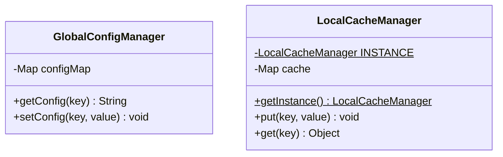

- Spring 结合点：`GlobalConfigManager` 由容器保证单例，与经典单例对照演示。
- 演示入口：`POST /pattern/singleton/setConfig`、`GET /pattern/singleton/sameInstance`（返回两次获取是否引用相等，验证 需求 2.2）。
- Pattern_Doc：`creational/singleton/doc/singleton.md`。

#### 2. 工厂方法 Factory Method（P0）

- 业务场景：按支付渠道创建支付处理器，至少支持 2 种渠道（微信、支付宝），按传入渠道标识返回对应实现（需求 2.3、2.4）。
- 角色—类映射：

| GoF 角色 | 类名 | 职责 |
| --- | --- | --- |
| Product | `PaymentProcessor`（接口） | `pay(PaymentContext)`、`channel()` |
| ConcreteProduct | `WechatPaymentProcessor`、`AlipayPaymentProcessor` | 各渠道支付逻辑 |
| Factory | `PaymentProcessorFactory` | `create(String channel)`：按标识返回处理器，未知渠道抛 `ServiceException` 且不创建实例 |

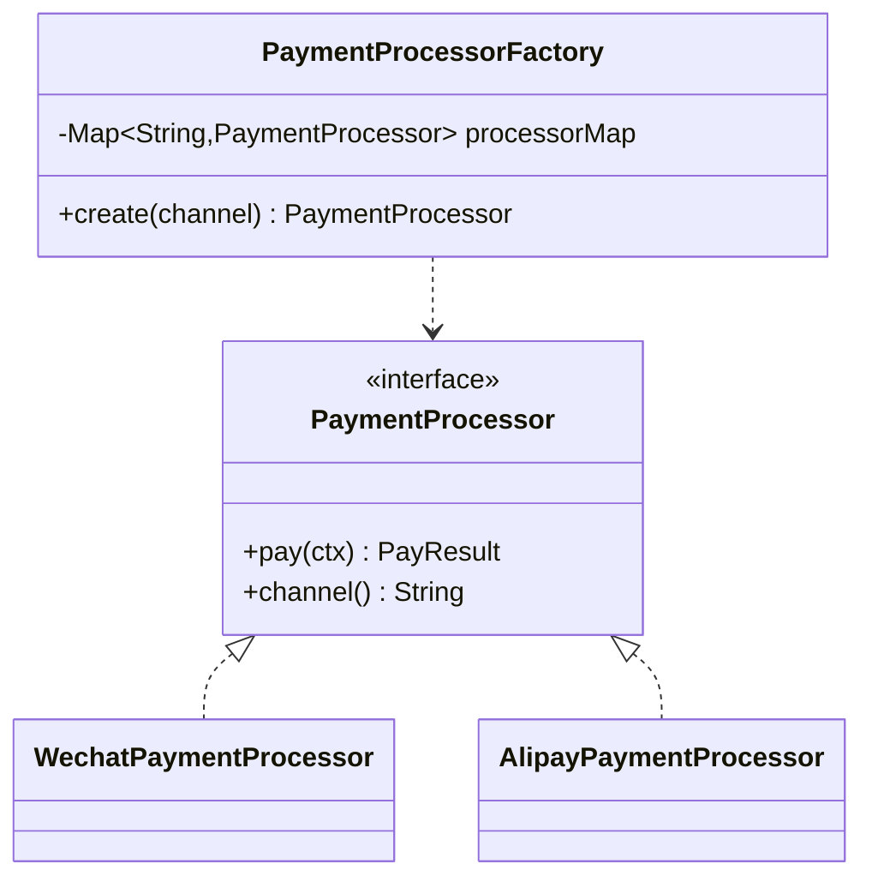

- Spring 结合点：利用 Spring 将所有 `PaymentProcessor` 实现注入为 `Map<String,PaymentProcessor>`（key 为 bean 名/渠道标识），工厂按标识选实现（需求 10.4、10.5）。
- 演示入口：`POST /pattern/factory/pay`（body 含 channel）；未知渠道返回错误响应（需求 2.4）。
- Pattern_Doc：`creational/factorymethod/doc/factorymethod.md`。

#### 3. 抽象工厂 Abstract Factory（P0）

- 业务场景：多云对象存储产品族创建，覆盖至少 2 个云厂商（阿里云 OSS、AWS S3），每个产品族含至少 2 种关联产品（存储客户端 + 签名 URL 生成器）（需求 2.5）。
- 角色—类映射：

| GoF 角色 | 类名 | 职责 |
| --- | --- | --- |
| AbstractFactory | `CloudStorageFactory`（接口） | `createStorageClient()`、`createUrlSigner()` |
| ConcreteFactory | `AliyunStorageFactory`、`AwsStorageFactory` | 创建本厂商产品族 |
| AbstractProductA | `StorageClient`（接口） | `upload(key, bytes)` |
| AbstractProductB | `UrlSigner`（接口） | `sign(key, expireSeconds)` |
| ConcreteProduct | `AliyunStorageClient`/`AliyunUrlSigner`/`AwsStorageClient`/`AwsUrlSigner` | 各厂商实现 |

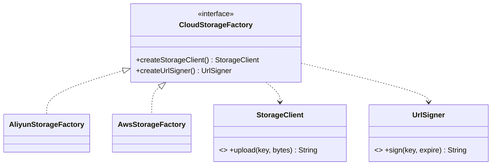

- Spring 结合点：各 ConcreteFactory 为 Spring Bean，按厂商标识选取（需求 10.4）。
- 演示入口：`POST /pattern/abstractfactory/upload`（body 含 vendor、key）。
- Pattern_Doc：`creational/abstractfactory/doc/abstractfactory.md`。

#### 4. 建造者 Builder（P0）

- 业务场景：通知消息（含必选「接收人」+ 可选「标题/正文/附件/优先级」）分步构建（需求 2.6）。
- 角色—类映射：`NotificationMessage`（Product，含静态 `builder()`）、`NotificationMessageBuilder`（Builder，链式 `to()/title()/content()/attach()/priority()/build()`，`build()` 校验必选部件）。
- Spring 结合点：Builder 为无状态工具，演示与 Service 协作；构建逻辑与对象解耦。
- 演示入口：`POST /pattern/builder/buildNotification`。
- Pattern_Doc：`creational/builder/doc/builder.md`。

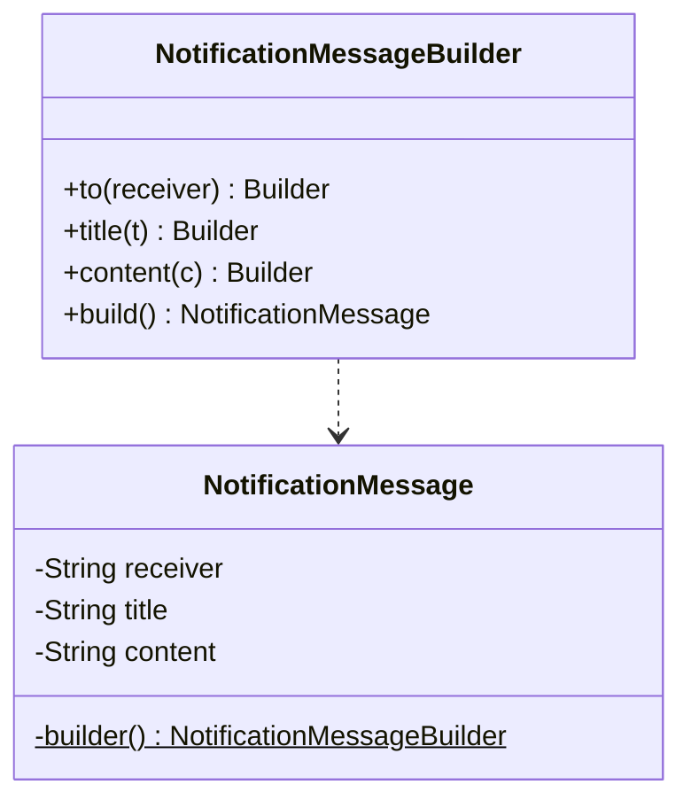

#### 5. 原型 Prototype（P1）

- 业务场景：营销活动模板克隆复制，克隆得到深拷贝副本，修改副本不影响原型（需求 2.7、2.8）。
- 角色—类映射：`CampaignTemplate`（Prototype，实现 `deepClone()`，含嵌套对象如规则列表 `List<CampaignRule>` 以体现深拷贝）、`CampaignRule`（嵌套可变对象）。
- 关键方法：`CampaignTemplate deepClone()`（逐字段深拷贝，含集合与嵌套对象）。
- 演示入口：`POST /pattern/prototype/cloneTemplate`。
- Pattern_Doc：`creational/prototype/doc/prototype.md`。

### 二、结构型模式（Structural）

#### 6. 代理 Proxy（P0）

- 业务场景：结合 Spring AOP 的接口查询「缓存 + 限流」代理。代理与目标实现同一接口，在不改目标代码的前提下织入横切逻辑（需求 3.1、10.2）。
- 角色—类映射：`ReportQueryService`（Subject 接口）、`ReportQueryServiceImpl`（RealSubject，纯查询逻辑）、`CacheRateLimitAspect`（以 AOP 充当 Proxy，织入缓存命中与令牌桶/计数限流）。
- Spring 结合点：Spring AOP（`@Aspect` + 切点表达式）作为动态代理织入；缓存命中复用结果，超限抛 `ServiceException`。
- 演示入口：`POST /pattern/proxy/queryReport`（重复调用观察缓存命中；高频调用观察限流）。
- Pattern_Doc：`structural/proxy/doc/proxy.md`。

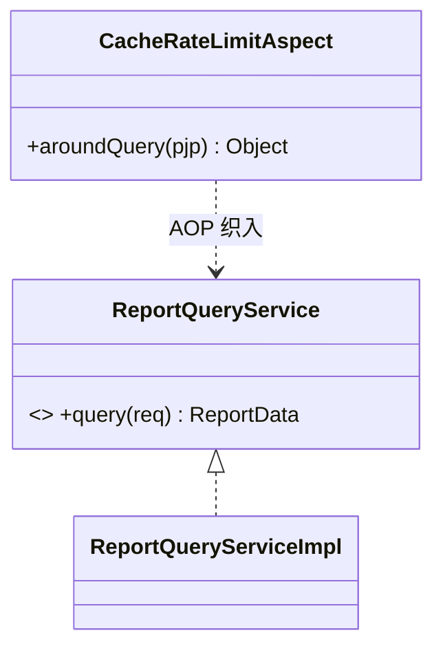

#### 7. 适配器 Adapter（P0）

- 业务场景：统一短信发送接口对接至少 2 家签名互不相同的服务商（阿里云短信、腾讯云短信）（需求 3.2）。
- 角色—类映射：`SmsSender`（Target 接口，`send(SmsRequest)`）、`AliyunSmsClient`/`TencentSmsClient`（Adaptee，签名各异的第三方 SDK 模拟）、`AliyunSmsAdapter`/`TencentSmsAdapter`（Adapter，将统一接口适配到各 Adaptee）。
- Spring 结合点：各 Adapter 为 Bean，按服务商标识选取。
- 演示入口：`POST /pattern/adapter/sendSms`（body 含 vendor、phone、content）。
- Pattern_Doc：`structural/adapter/doc/adapter.md`。

#### 8. 装饰器 Decorator（P0）

- 业务场景：通知发送能力增强，提供至少 2 个可任意叠加的装饰能力（签名、加密、日志）（需求 3.3）。
- 角色—类映射：`NotifySender`（Component 接口）、`BaseNotifySender`（ConcreteComponent）、`NotifyDecorator`（抽象 Decorator，持有 `NotifySender`）、`SignatureDecorator`/`EncryptDecorator`/`LogDecorator`（ConcreteDecorator）。
- Spring 结合点：装饰链由 Service 按需组装；体现「组合优于继承」（需求 8.3）。
- 演示入口：`POST /pattern/decorator/send`（body 指定要叠加的能力列表）。
- Pattern_Doc：`structural/decorator/doc/decorator.md`。

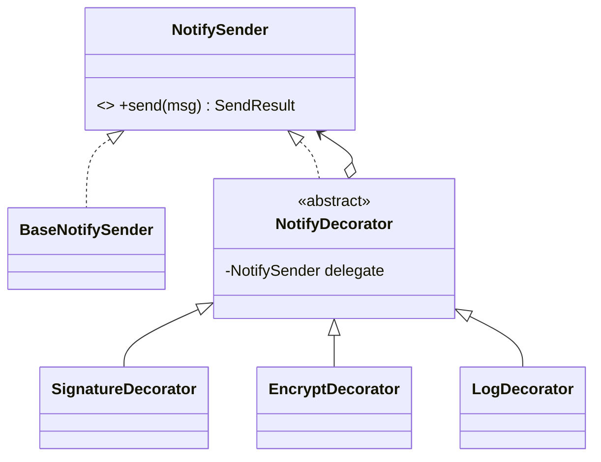

#### 9. 外观 Facade（P0）

- 业务场景：下单流程通过单一外观接口编排库存、优惠、支付至少 3 个子系统（需求 3.4）。
- 角色—类映射：`OrderPlacementFacade`（Facade）、`InventoryService`/`PromotionSubSystemService`/`PaymentSubSystemService`（SubSystem）。Facade 的 `placeOrder()` 顺序编排扣减库存→计算优惠→发起支付。
- Spring 结合点：子系统以接口注入 Facade；调用方仅依赖 Facade。
- 演示入口：`POST /pattern/facade/placeOrder`。
- Pattern_Doc：`structural/facade/doc/facade.md`。

#### 10. 桥接 Bridge（P1）

- 业务场景：消息推送解耦为「推送渠道」与「消息类型」两个维度，每维度各至少 2 个可独立扩展变体（需求 3.5）。
- 角色—类映射：`PushChannel`（Implementor 接口：`App`/`Sms` 两实现）、`AbstractMessage`（Abstraction，持有 `PushChannel`）、`MarketingMessage`/`SystemMessage`（RefinedAbstraction）。两维度可独立扩展。
- 演示入口：`POST /pattern/bridge/push`（body 含 messageType、channel）。
- Pattern_Doc：`structural/bridge/doc/bridge.md`。

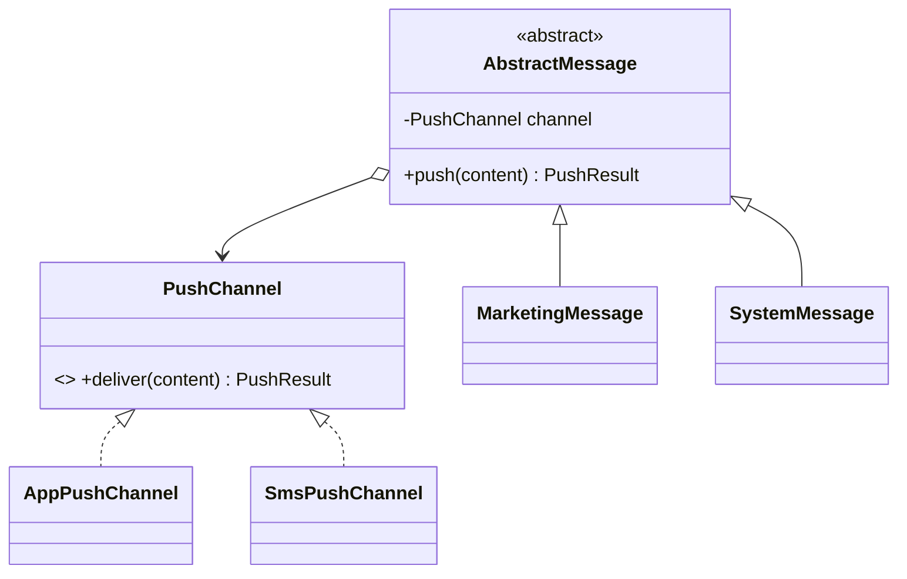

#### 11. 组合 Composite（P1）

- 业务场景：审批节点树的统一处理，树至少含一个组合节点与一个叶子节点，通过同一接口递归处理（需求 3.6）。
- 角色—类映射：`ApprovalNode`（Component 接口：`process()`、`countLeaves()`）、`ApprovalLeaf`（Leaf，具体审批人）、`ApprovalGroup`（Composite，含子节点列表，递归处理）。
- 演示入口：`POST /pattern/composite/process`（构造树并递归处理）。
- Pattern_Doc：`structural/composite/doc/composite.md`。

#### 12. 享元 Flyweight（P1）

- 业务场景：风控规则/数据字典共享对象复用；相同内蕴状态标识重复获取返回同一共享实例（需求 3.7、3.8）。
- 角色—类映射：`RiskRule`（Flyweight，内蕴状态来自 `risk_rule_dict` 表）、`RiskRuleFactory`（FlyweightFactory，内部缓存 `Map<String,RiskRule>`，`getRule(code)` 复用实例）。
- Spring 结合点 / 持久化：内蕴状态从 H2 加载，工厂缓存共享。
- 演示入口：`GET /pattern/flyweight/sameRule`（同 code 两次获取返回引用相等）。
- Pattern_Doc：`structural/flyweight/doc/flyweight.md`。

### 三、行为型模式（Behavioral）

#### 13. 策略 Strategy（P0）

- 业务场景：促销优惠计算，至少含满减、折扣、立减三种可相互替换策略（需求 4.1）。
- 角色—类映射：`PromotionStrategy`（Strategy 接口：`calculate(PromotionContext)`、`type()`）、`FullReductionStrategy`/`DiscountStrategy`/`DirectReductionStrategy`（ConcreteStrategy）、`PromotionCalculateService`（Context，按类型选策略）。
- Spring 结合点：策略实现注入为 `Map<String,PromotionStrategy>`，按类型标识选取（需求 10.4、10.5）。
- 演示入口：`POST /pattern/strategy/calculate`。
- Pattern_Doc：`behavioral/strategy/doc/strategy.md`。

#### 14. 模板方法 Template Method（P0）

- 业务场景：对账流程，算法骨架以固定顺序编排步骤，至少一个步骤为子类重写的抽象步骤（需求 4.2）。
- 角色—类映射：`AbstractReconcileTemplate`（AbstractClass，`final reconcile()` 固定骨架：拉取→解析→比对→生成差异报告，其中 `parse()`/`fetch()` 为抽象步骤）、`AlipayReconcileTemplate`/`WechatReconcileTemplate`（ConcreteClass）。
- 演示入口：`POST /pattern/template/reconcile`（body 含 channel）。
- Pattern_Doc：`behavioral/templatemethod/doc/templatemethod.md`。

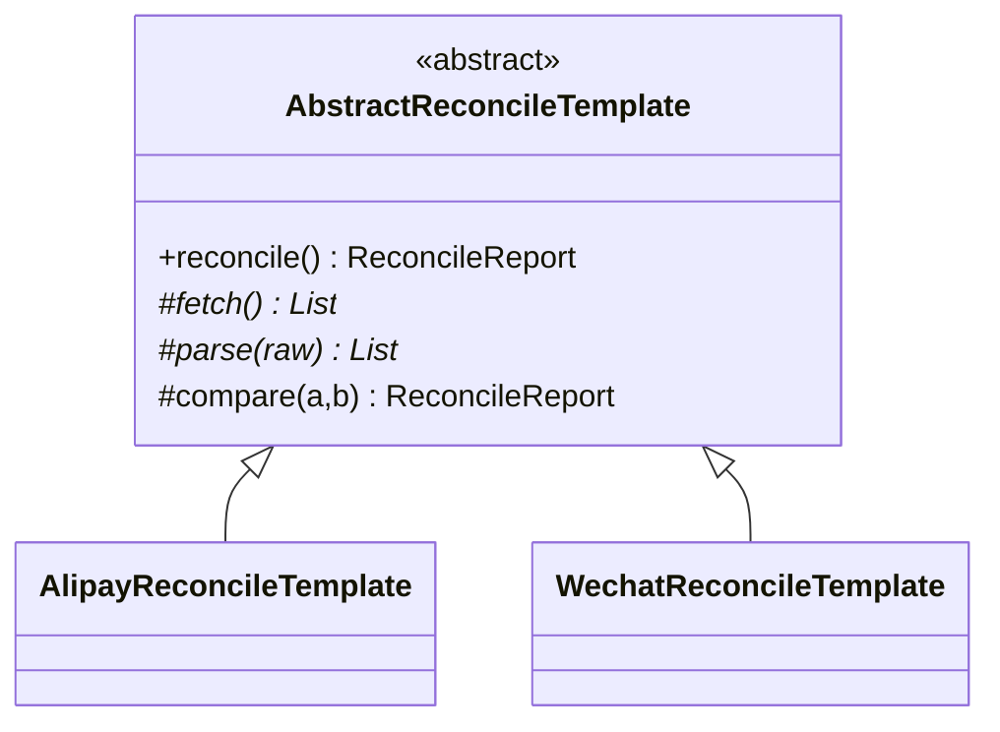

#### 15. 观察者 Observer（P0）

- 业务场景：结合 Spring 事件机制的订单状态变更通知，同一事件注册至少两个相互独立的监听者（需求 4.3、10.3）。
- 角色—类映射：`OrderStatusChangedEvent`（事件）、`OrderStatusEventPublisher`（发布者，`ApplicationEventPublisher`）、`SmsNotifyListener`/`PointsRewardListener`（两个独立监听者）。
- Spring 结合点：`@EventListener` 监听，发布方与监听方解耦（需求 10.3）。
- 演示入口：`POST /pattern/observer/changeOrderStatus`。
- Pattern_Doc：`behavioral/observer/doc/observer.md`。

#### 16. 责任链 Chain of Responsibility（P0）

- 业务场景：风控规则校验链，至少两个按序节点，请求沿链依次传递直至被拦截或通过全部节点（需求 4.4）。
- 角色—类映射：`RiskRuleHandler`（Handler 接口：`handle(RiskContext)`、`order()`）、`AmountLimitHandler`/`BlacklistHandler`/`FrequencyHandler`（ConcreteHandler）、`RiskRuleChain`（链装配与驱动，按 `order()` 排序）。
- Spring 结合点：所有 Handler 注入为 `List<RiskRuleHandler>`，按序组链。
- 演示入口：`POST /pattern/chain/riskCheck`。
- Pattern_Doc：`behavioral/chain/doc/chain.md`。

#### 17. 状态 State（P0）

- 业务场景：订单状态机流转，至少三个状态（已创建/已支付/已发货/已完成/已取消），显式定义合法流转；非法流转被拒绝并保持原状态、返回错误（需求 4.5、4.6）。
- 角色—类映射：`OrderState`（State 接口：各状态可执行动作 `pay()/ship()/complete()/cancel()`）、`CreatedState`/`PaidState`/`ShippedState`/`CompletedState`/`CancelledState`（ConcreteState）、`OrderStateContext`（Context，持有当前状态与订单，驱动流转，非法流转抛 `IllegalStateTransitionException`）。
- 持久化：订单存于 `biz_order`，流转后更新状态字段。
- 演示入口：`POST /pattern/order/changeStatus`（body 含 orderId、action）。
- Pattern_Doc：`behavioral/state/doc/state.md`。

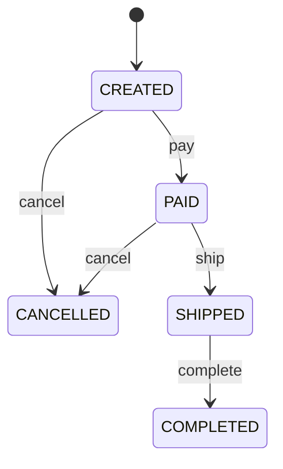

#### 18. 命令 Command（P0）

- 业务场景：管理后台对商品的操作（新增/修改/删除），每个操作封装为命令对象，执行后记录于可追溯命令历史；撤销逆向执行最近一次命令并恢复数据（需求 4.7、4.8）。
- 角色—类映射：

| GoF 角色 | 类名 | 职责 |
| --- | --- | --- |
| Command | `OperationCommand`（接口） | `execute()`、`undo()`、`describe()` |
| ConcreteCommand | `AddProductCommand`、`UpdateProductCommand`、`DeleteProductCommand` | 各操作的正/逆执行，保存 before/after 快照 |
| Receiver | `ProductService` | 真正的商品增删改 |
| Invoker | `CommandInvoker` | `invoke(cmd)` 执行并入历史；`undoLast()` 撤销最近命令 |
| 历史存储 | `sys_command_history` 表 | 持久化命令历史，支持追溯 |

- 删除命令演示删除接口规范：`GET /pattern/command/deleteProduct`，携带显式删除标识 `confirmDelete` + `@RequiresPermission("pattern:product:remove")`（需求 9.7、9.10、9.11）。
- 其他演示入口：`POST /pattern/command/execute`、`POST /pattern/command/undo`。
- Pattern_Doc：`behavioral/command/doc/command.md`。

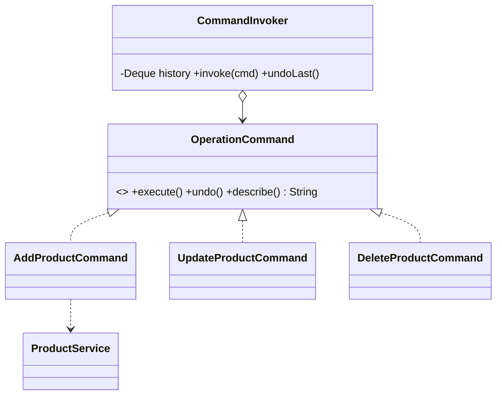

#### 19. 迭代器 Iterator（P1）

- 业务场景：自定义分页结果集的统一遍历（需求 4.9）。
- 角色—类映射：`PageIterator<T>`（Iterator 接口：`hasNext()`/`next()`，跨页自动加载）、`PagedResultSet<T>`（Aggregate，`iterator()`）、`PageDataLoader<T>`（按页加载回调）。
- 演示入口：`GET /pattern/iterator/traverse`。
- Pattern_Doc：`behavioral/iterator/doc/iterator.md`。

#### 20. 中介者 Mediator（P1）

- 业务场景：售后工单多方协作（客户、客服、仓库），各方仅通过中介者交互，不直接相互引用（需求 4.10）。
- 角色—类映射：`AfterSaleMediator`（Mediator 接口）、`AfterSaleMediatorImpl`（ConcreteMediator）、`Colleague`（抽象同事，持有 mediator）、`CustomerColleague`/`AgentColleague`/`WarehouseColleague`（ConcreteColleague）。
- 演示入口：`POST /pattern/mediator/handleTicket`。
- Pattern_Doc：`behavioral/mediator/doc/mediator.md`。

#### 21. 备忘录 Memento（P1）

- 业务场景：草稿内容的保存与恢复（需求 4.11）。
- 角色—类映射：`DraftDocument`（Originator，`save()` 生成 `DraftMemento`、`restore(memento)`）、`DraftMemento`（Memento，不可变快照）、`DraftCaretaker`（Caretaker，保存历史快照栈）。
- 演示入口：`POST /pattern/memento/saveDraft`、`POST /pattern/memento/restoreDraft`。
- Pattern_Doc：`behavioral/memento/doc/memento.md`。

---

## Data Models

### 持久化范围划分

| 模式 | 是否持久化 | 说明 |
| --- | --- | --- |
| 状态 State | 是 | 订单状态机需持久化订单与状态字段（`biz_order`） |
| 命令 Command | 是 | 操作目标商品（`biz_product`）与命令历史（`sys_command_history`），撤销需读取快照恢复 |
| 享元 Flyweight | 是 | 风控规则字典内蕴状态来源（`risk_rule_dict`） |
| 其余 18 个模式 | 否（内存模拟） | 单例缓存、工厂、抽象工厂、建造者、原型、代理、适配器、装饰器、外观、桥接、组合、策略、模板方法、观察者、责任链、迭代器、中介者、备忘录均以内存对象模拟数据，聚焦模式结构本身 |

> 选择以上三处持久化，既覆盖团队 MyBatis 规范（C11：SQL 写 XML、禁用 Wrapper，满足 需求 9.8、9.9），又与各模式的真实业务语义自然契合（订单需落库、操作历史需可追溯、字典需共享）。H2 采用内存模式，应用启动时通过 `schema.sql` + `data.sql` 自动建表与初始化。

### 表结构与实体设计

#### biz_order（订单 —— 状态模式）

| 字段 | 类型 | 说明 |
| --- | --- | --- |
| id | BIGINT PK | 主键 |
| order_no | VARCHAR(32) | 订单号（唯一） |
| amount | DECIMAL(12,2) | 订单金额 |
| status | VARCHAR(16) | 订单状态：CREATED/PAID/SHIPPED/COMPLETED/CANCELLED |
| create_time | TIMESTAMP | 创建时间 |
| update_time | TIMESTAMP | 更新时间 |

对应实体 `OrderEntity`（`@Data`，中文字段 Javadoc）；Mapper：`OrderMapper` + `OrderMapper.xml`（`selectById`、`updateStatus`，SQL 全在 XML）。

#### biz_product（商品 —— 命令模式操作目标）

| 字段 | 类型 | 说明 |
| --- | --- | --- |
| id | BIGINT PK | 主键 |
| product_name | VARCHAR(64) | 商品名称 |
| price | DECIMAL(12,2) | 商品价格 |
| status | TINYINT | 状态：1 正常 / 0 已删除（逻辑删除，便于撤销恢复） |
| create_time | TIMESTAMP | 创建时间 |

对应实体 `ProductEntity`；Mapper：`ProductMapper` + XML（`insert`、`updateById`、`logicDelete`、`restore`、`selectById`）。

#### sys_command_history（命令历史 —— 命令模式）

| 字段 | 类型 | 说明 |
| --- | --- | --- |
| id | BIGINT PK | 主键 |
| command_type | VARCHAR(32) | 命令类型：ADD/UPDATE/DELETE |
| target_id | BIGINT | 目标商品 id |
| before_snapshot | VARCHAR(1024) | 执行前数据快照（JSON），用于撤销 |
| after_snapshot | VARCHAR(1024) | 执行后数据快照（JSON） |
| status | TINYINT | 状态：1 已执行 / 0 已撤销 |
| operator | VARCHAR(32) | 操作人 |
| create_time | TIMESTAMP | 创建时间 |

对应实体 `CommandHistoryEntity`；Mapper：`CommandHistoryMapper` + XML（`insert`、`selectLastExecuted`、`markUndone`）。

#### risk_rule_dict（风控规则字典 —— 享元模式）

| 字段 | 类型 | 说明 |
| --- | --- | --- |
| id | BIGINT PK | 主键 |
| rule_code | VARCHAR(32) | 规则编码（享元内蕴状态键，唯一） |
| rule_name | VARCHAR(64) | 规则名称 |
| threshold | DECIMAL(12,2) | 阈值 |
| enabled | TINYINT | 是否启用：1/0 |

对应实体 `RiskRuleEntity`；Mapper：`RiskRuleMapper` + XML（`selectByCode`、`selectAllEnabled`）。

### 内存模拟数据约定

不持久化的模式以 `final` 常量、`Map` 或在 Service 内构造的对象模拟业务数据，确保演示入口可独立触发（需求 11.1）、可观察结果（需求 11.2），且不引入不必要的数据库耦合。

---

## Priority_List（模式优先级清单）

依据「企业实战常用度（高频/中频/低频）+ 典型企业应用场景」对需求 2~4 列出的全部 23 个目标模式分级，每个模式恰好归入 P0/P1/P2 之一（满足 需求 5.1、5.2）。本档实现 P0（14 个）+ P1（7 个）= 21 个；P2（2 个）不实现并说明取舍（满足 需求 5.3、5.4）。

### P0 核心模式（高频，必须实现，共 14 个）

| 模式 | 类别 | 常用度 | 典型企业场景 | 判定依据 |
| --- | --- | --- | --- | --- |
| 单例 Singleton | 创建型 | 高频 | 全局配置、本地缓存管理器 | Spring Bean 默认单例，几乎所有项目使用 |
| 工厂方法 Factory Method | 创建型 | 高频 | 按支付渠道创建处理器 | 多实现按标识创建是企业常见诉求 |
| 抽象工厂 Abstract Factory | 创建型 | 中高频 | 多云存储产品族 | 多产品族切换（多云/多租户）常见 |
| 建造者 Builder | 创建型 | 高频 | 通知/订单分步构建 | 复杂对象构造广泛使用 |
| 代理 Proxy | 结构型 | 高频 | AOP 缓存与限流 | Spring AOP 本质即代理，企业普遍 |
| 适配器 Adapter | 结构型 | 高频 | 统一短信对接多服务商 | 第三方对接标配 |
| 装饰器 Decorator | 结构型 | 中高频 | 通知能力叠加 | 能力增强组合常见 |
| 外观 Facade | 结构型 | 高频 | 下单流程编排子系统 | 子系统聚合广泛使用 |
| 策略 Strategy | 行为型 | 高频 | 促销优惠计算 | 算法可替换的典型 |
| 模板方法 Template Method | 行为型 | 高频 | 对账/导入流程 | 固定骨架+可变步骤常见 |
| 观察者 Observer | 行为型 | 高频 | Spring 事件订单通知 | Spring 事件机制即观察者 |
| 责任链 Chain of Responsibility | 行为型 | 高频 | 风控校验链 | 校验/过滤链广泛使用 |
| 状态 State | 行为型 | 高频 | 订单状态机 | 业务状态流转标配 |
| 命令 Command | 行为型 | 中高频 | 后台操作+撤销 | 操作封装/撤销/审计常见 |

### P1 扩展模式（中频，建议实现，共 7 个）

| 模式 | 类别 | 常用度 | 典型企业场景 | 判定依据 |
| --- | --- | --- | --- | --- |
| 原型 Prototype | 创建型 | 中频 | 营销模板克隆 | 模板复制场景中频出现 |
| 桥接 Bridge | 结构型 | 中频 | 推送渠道×消息类型 | 双维度独立扩展中频 |
| 组合 Composite | 结构型 | 中频 | 审批节点树 | 树形结构处理中频 |
| 享元 Flyweight | 结构型 | 中低频 | 风控规则/字典共享 | 共享复用场景相对少见 |
| 迭代器 Iterator | 行为型 | 中低频 | 自定义分页遍历 | JDK 已内置，自定义需求较少 |
| 中介者 Mediator | 行为型 | 中频 | 售后工单协作 | 多方解耦中频 |
| 备忘录 Memento | 行为型 | 中频 | 草稿保存恢复 | 快照/撤销场景中频 |

### P2 可选模式（低频，本档不实现，共 2 个）

| 模式 | 类别 | 常用度 | 取舍理由（含未实现原因 + 优先级等级） |
| --- | --- | --- | --- |
| 访问者 Visitor | 行为型 | 低频 | 等级 P2。结构复杂、双分派学习成本高，企业中财务报表统计等场景出现频率低，且常被策略/多态替代；为聚焦高价值模式，本档推迟实现。 |
| 解释器 Interpreter | 行为型 | 低频 | 等级 P2。风控表达式求值在企业中通常引入成熟规则引擎（如 Aviator、Drools）而非自研解释器，自研性价比低；本档省略，仅在清单中保留场景说明。 |

> 满足 需求 5.4：P0 全部实现，无遗漏。

---

## Correctness Properties

*属性（Property）是指在系统所有合法执行下都应当恒成立的特征或行为——它是对「系统应当做什么」的一种形式化陈述。属性充当了人类可读的规格说明与机器可验证的正确性保证之间的桥梁。*

> 属性推导与反思说明：依据上文 prework 的可测性分类，先对冗余项进行合并（实例共享 2.2/3.8；按标识选实现 2.3/10.4；错误路径 2.4/10.5/6.6/11.3；命令历史与撤销 4.7/4.8；状态合法与非法流转 4.5/4.6；删除安全边界 9.10/9.11）。再依据「行为是否随输入显著变化」的决策准则，将**初判为属性但实际不随输入变化或输入空间有限/依赖框架织入**的判定项（抽象工厂同族一致性 2.5、桥接维度组合 3.5、模板方法步骤顺序 4.2、观察者多播 4.3）调整为示例测试或集成测试（见 Testing Strategy）。最终保留以下 16 条互不冗余、各具独立验证价值的正确性属性。

### Property 1：实例共享与单例性

*对任意*单例访问入口的多次获取，以及享元工厂对任意相同内蕴状态标识（rule_code）的多次获取，返回的对象引用恒相等（指向同一实例）。

**Validates: Requirements 2.2, 3.7, 3.8**

### Property 2：按标识选实现的正确性

*对任意*受支持的实现标识（支付渠道、策略类型、容器中可注入实现标识），按标识选取机制返回的实现唯一确定，且其自身声明的标识与请求标识一致。

**Validates: Requirements 2.3, 10.4**

### Property 3：非法输入与越权请求返回可观察错误且无副作用

*对任意*非法输入（空值、越界、未知或无匹配标识）或执行失败的演示调用，系统返回带失败原因的可观察错误结果（`AjaxResult.error` 或经全局异常处理器转换的错误响应），不静默失败，且不产生实例创建、数据写入等副作用。

**Validates: Requirements 2.4, 6.6, 10.5, 11.3**

### Property 4：建造者构建保真

*对任意*必选部件与可选部件的设置组合，建造者构建出的对象恰好包含已设置部件的取值；当必选部件缺失时，构建被拒绝并报错。

**Validates: Requirements 2.6**

### Property 5：原型深拷贝独立性

*对任意*营销活动模板原型，深克隆得到的副本与原型各字段值相等；对副本（含嵌套集合与嵌套对象）的任意后续修改都不改变原型对象。

**Validates: Requirements 2.8**

### Property 6：代理缓存幂等一致性

*对任意*查询参数，经缓存代理的重复查询在缓存有效期内返回与首次调用一致的结果（同参幂等）。

**Validates: Requirements 3.1**

### Property 7：适配器统一接口委派

*对任意*受支持的短信服务商标识与合法短信请求（手机号、内容），统一 `SmsSender` 接口都将请求正确委派至对应服务商适配器并返回成功结果，且消息内容被无损传递。

**Validates: Requirements 3.2**

### Property 8：装饰器能力任意叠加

*对任意*装饰能力子集（签名、加密、日志）与叠加顺序，最终装饰链的发送结果体现所有已叠加能力的效果。

**Validates: Requirements 3.3**

### Property 9：组合递归一致性

*对任意*审批节点树，通过统一接口递归处理的结果满足组合不变式：叶子计数等于各子树叶子计数之和，且组合节点与叶子节点均被处理。

**Validates: Requirements 3.6**

### Property 10：策略计算不变式

*对任意*订单金额与策略参数，满减、折扣、立减各策略的计算结果满足：优惠额 ≥ 0、优惠额 ≤ 原金额，且优惠后金额 = 原金额 − 优惠额。

**Validates: Requirements 4.1**

### Property 11：责任链传递与短路

*对任意*风控校验请求，结果为「通过」当且仅当所有节点均通过；当请求在某节点被拦截时，该拦截节点之后的节点不再被执行。

**Validates: Requirements 4.4**

### Property 12：状态机合法与非法流转

*对任意*订单当前状态与触发动作，若该（状态, 动作）为已定义的合法流转，则订单转入唯一确定的目标状态；否则流转被拒绝、订单保持变更前状态，并返回指示该流转非法的错误结果。

**Validates: Requirements 4.5, 4.6**

### Property 13：命令历史与撤销往返

*对任意*管理后台命令序列，每次执行使命令历史新增一条对应记录；对最近一次已执行命令执行撤销后，受影响数据恢复至该命令执行前的状态。

**Validates: Requirements 4.7, 4.8**

### Property 14：迭代器遍历完整性

*对任意*分页数据集与页大小，迭代器遍历产出的元素序列在数量与顺序上与原始数据集完全一致。

**Validates: Requirements 4.9**

### Property 15：备忘录保存恢复往返

*对任意*草稿内容，保存生成备忘录后对草稿进行任意修改，再从该备忘录恢复，草稿内容等于保存时的快照。

**Validates: Requirements 4.11**

### Property 16：删除操作安全边界

*对任意*通过 GET 暴露的删除请求，仅当「携带非空删除标识」且「当前用户具备所需权限」两者同时满足时才执行删除；否则拒绝执行、目标数据保持不变，并返回指示失败原因的错误响应。

**Validates: Requirements 9.10, 9.11**

---

## Error Handling

### 统一异常处理机制

全部异常由 `GlobalExceptionHandler`（`@RestControllerAdvice`）集中拦截并转换为统一错误响应，Controller 内严禁 try-catch（落实 C6，满足 需求 6.6、11.3）。错误响应统一为 `AjaxResult.error(code, msg)`，保证「非静默失败」。

### 异常体系

| 异常类 | 触发场景 | 处理结果 |
| --- | --- | --- |
| `ServiceException` | 通用业务异常（未知渠道、无匹配实现、限流超阈值、必选部件缺失等） | `error(msg)` |
| `IllegalStateTransitionException` | 订单状态机非法流转 | `error(msg)`，订单状态保持不变 |
| `PermissionDeniedException` | 删除等敏感操作权限校验失败 | `error("无操作权限")`，目标数据不变 |
| `MethodArgumentNotValidException` | `@Validated` 参数校验失败 | `error`，聚合返回字段级错误信息 |
| `Exception`（兜底） | 未预期异常 | `error("系统异常")`，记录日志，不向调用方泄露堆栈细节 |

### 各模式异常与边界路径处理

| 模式 / 场景 | 边界/异常输入 | 处理方式 | 关联属性/需求 |
| --- | --- | --- | --- |
| 工厂方法 | 未知支付渠道标识 | 抛 `ServiceException`，不创建实例 | Property 3 / 需求 2.4 |
| 按标识选实现（容器） | 标识无匹配实现 | 抛 `ServiceException`，不返回实例 | Property 3 / 需求 10.5 |
| 状态机 | 非法状态流转动作 | 抛 `IllegalStateTransitionException`，状态不变 | Property 12 / 需求 4.6 |
| 删除接口 | 缺失删除标识 | 参数校验失败 → `error`，数据不变 | Property 16 / 需求 9.11 |
| 删除接口 | 权限校验未通过 | `PermissionDeniedException` → `error`，数据不变 | Property 16 / 需求 9.11 |
| 代理 | 调用频率超限流阈值 | 抛 `ServiceException("请求过于频繁")` | 需求 3.1 |
| 建造者 | 必选部件缺失 | `build()` 抛 `ServiceException` | Property 4 / 需求 2.6 |
| 通用演示入口 | 非法/不满足业务约束输入 | 经全局处理返回可观察错误 | Property 3 / 需求 6.6、11.3 |

### 启动期错误处理

构建或启动失败时（如 Bean 装配失败、SQL 初始化错误），Spring Boot 中止启动流程、不进入运行状态，并在控制台输出失败原因（满足 需求 1.7）。

---

## Testing Strategy

### 测试框架与栈

- 单元/示例与集成测试：JUnit 5 + Mockito + Spring Boot Test（`spring-boot-starter-test` 内置）。
- 属性测试（PBT）：jqwik 1.8.x，原生集成 JUnit 5 Platform；**不自研属性测试框架**。
- 持久化相关测试：基于 H2 内存库运行，结合 MyBatis 测试切片或 `@SpringBootTest`。

### 双重测试策略

- **单元/示例测试**：覆盖具体示例、边界条件与错误路径，并为每个模式提供至少一个断言核心行为正常路径的单测（满足 需求 11.4）。
- **属性测试**：针对上文 16 条正确性属性，每条属性以**单一**属性测试实现，覆盖广泛随机输入。

### 属性测试配置（强制）

- 每个属性测试最少运行 **100 次迭代**（jqwik `@Property(tries = 100)` 或更高）。
- 每个属性测试以注释标注其对应的设计属性，标签格式：
  `// Feature: design-patterns-showcase, Property {number}: {property_text}`
- 每条属性对应唯一一个属性测试方法，保持属性与测试一一对应、可追溯。

| 属性 | 对应模式 | 生成器要点 |
| --- | --- | --- |
| Property 1 | 单例 / 享元 | 随机获取次数；随机 rule_code（取自字典） |
| Property 2 | 工厂方法 / 容器选实现 | 随机受支持标识集合 |
| Property 3 | 全局错误路径 | 随机非法标识、空值、越界输入 |
| Property 4 | 建造者 | 随机可选部件子集 + 必选部件有/无 |
| Property 5 | 原型 | 随机模板（含嵌套规则列表） |
| Property 6 | 代理缓存 | 随机查询参数（目标用 mock） |
| Property 7 | 适配器 | 随机服务商标识 + 合法手机号/内容 |
| Property 8 | 装饰器 | 随机能力子集 + 随机叠加顺序 |
| Property 9 | 组合 | 随机生成审批树（深度/广度随机） |
| Property 10 | 策略 | 随机订单金额 + 策略参数 |
| Property 11 | 责任链 | 随机风控上下文（命中/不命中各节点） |
| Property 12 | 状态机 | 状态 × 动作全组合随机抽样 |
| Property 13 | 命令 | 随机命令序列（增/改/删） |
| Property 14 | 迭代器 | 随机数据集 + 随机页大小 |
| Property 15 | 备忘录 | 随机草稿内容 |
| Property 16 | 删除安全边界 | （删除标识有/无） × （有权/无权）组合 |

### 示例测试与集成测试（不可属性化或已降级项）

| 验收点 | 测试类型 | 说明 |
| --- | --- | --- |
| 抽象工厂同族一致性（2.5） | 示例测试 | 每个云厂商工厂各一例，断言产品族 vendor 一致 |
| 外观下单编排（3.4） | 示例测试 | 合法下单路径，断言三子系统按序调用 |
| 桥接维度组合（3.5） | 参数化示例 | 枚举 消息类型 × 渠道 全组合 |
| 模板方法步骤顺序（4.2） | 示例测试 | 断言步骤执行顺序恒为 fetch→parse→compare→report |
| 观察者多播（4.3、10.3） | 集成测试 | `@SpringBootTest` 验证事件发布后各监听者均被回调 |
| 中介者协作（4.10） | 示例测试 | 工单协作流程，消息经中介者转发 |
| 代理 AOP 织入 / 限流（10.2） | 集成测试 | 验证切面对目标方法生效、超阈值被拒 |
| 上下文加载（1.4） | 冒烟测试 | `@SpringBootTest` 上下文加载成功 |
| 演示入口清单（1.5） | 示例测试 | 断言 `DemoEntryRegistry` 含全部已实现模式且字段完整 |
| 删除接口 POST/GET 映射（9.6、9.7） | 集成测试 | MockMvc 验证增改为 POST、删除为 GET |

### 套件质量约束

- 全部单元/属性/集成测试必须通过，套件全绿。
- 套件**不包含**被禁用或跳过的测试（禁止 `@Disabled`/`@Ignore`），满足 需求 11.5。
- 设计原则与代码规范类约束（需求 8、需求 9.1~9.9）通过代码评审与必要的静态检查保障，不纳入运行期测试。

---

## Requirements 映射（可追溯矩阵）

下表将各需求映射到本设计的落地点，确保设计可追溯至需求（覆盖需求 1~11 的关键验收标准）。

| 需求 | 设计落地点 |
| --- | --- |
| 1.1~1.4、1.6 | Overview 技术栈选型表；Architecture 分层与包结构；pom.xml 统一版本 |
| 1.5 | 基础设施 `DemoEntryPrinter` + `DemoEntryRegistry`；Testing Strategy 清单示例测试 |
| 1.7 | Error Handling 启动期错误处理 |
| 2.1~2.8 | Components 创建型五模式详细设计；Property 1/2/3/4/5 |
| 3.1~3.8 | Components 结构型七模式详细设计；Property 1/3/6/7/8/9；示例（3.4、3.5） |
| 4.1~4.11 | Components 行为型九模式详细设计；Property 10/11/12/13/14/15；示例/集成（4.2、4.3、4.10） |
| 4.12~4.13 | Priority_List P2 取舍说明（不实现） |
| 5.1~5.4 | Priority_List 全量分级表与取舍理由 |
| 6.1~6.6 | Components 各模式业务场景与角色—类映射；Property 3；编码规范 C1 |
| 7.1~7.6 | 各模式子包 `doc/<pattern>.md` 统一四段式 Pattern_Doc |
| 8.1~8.6 | 编码规范约束专节；接口抽象化设计；代码评审保障 |
| 9.1~9.9 | 编码规范约束专节（C1~C12）；基础设施 BaseController；MyBatis XML 设计 |
| 9.10~9.11 | 简化权限校验机制（`RequiresPermission` + `PermissionAspect`）；命令模式删除接口；Property 16 |
| 10.1~10.5 | 各模式 Spring 结合点；`Map`/`List` 注入按标识选实现；Property 2/3；AOP 与事件集成测试 |
| 11.1~11.5 | 各模式独立演示入口；Testing Strategy 双重测试与套件质量约束 |

---

## 待确认的设计决策

以下决策已按「企业普遍性优先的标准档」做出选择，如需调整请在评审时指出：

1. **技术档位**：Spring Boot 2.7.18 + JDK 8 + MyBatis Starter 2.3.2 + H2 内存库。若团队倾向 3.x + JDK 17，需相应调整 MyBatis Starter 至 3.0.x 并复核 Java 8 语法。
2. **持久化范围**：仅状态、命令、享元三模式落库（4 张表），其余 18 模式内存模拟。若希望更多模式持久化（如观察者订单、对账流水），可扩展表设计。
3. **属性测试库**：选用 jqwik。若团队已有其他 PBT 库偏好，可替换（属性定义不变）。
4. **权限校验形态**：采用「自定义注解 + AOP 切面」mock 当前用户与权限。若希望用拦截器（HandlerInterceptor）实现，可等价替换。
